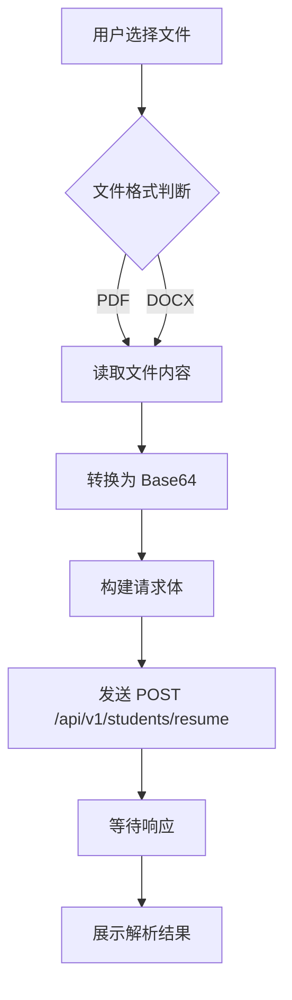
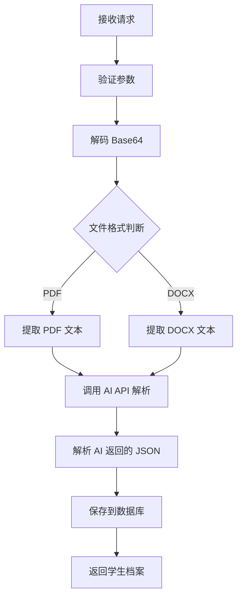

# 简历功能前后端对接文档

## 一、功能概述

简历功能是系统的核心功能之一，主要流程如下：

1. **用户上传简历文件**（支持 PDF、DOCX 格式）
2. **后端预处理提取文本内容**
3. **调用 AI API 进行简历解析**
4. **返回结构化的学生档案和优化建议**
5. **前端展示解析结果和优化建议**

---

## 二、当前实现状态

### 2.1 前端实现状态

**文件路径**：`high-school-worker-design-forend/src/pages/Resume/index.tsx`

**当前状态**：
- ✅ UI 框架已实现（使用 Steps 组件显示流程）
- ✅ 文件上传组件已实现（支持 PDF、Word 格式）
- ✅ 使用 setTimeout 模拟解析过程
- ❌ **未对接真实 API**（目前使用 mock 数据）
- ❌ **未实现文件转 base64 功能**

**API 调用定义**：
- `studentApi.uploadResume()` - 上传简历（已定义但未使用）
- `studentApi.generate()` - AI 生成档案（已定义但未使用）

**类型定义**：
- `ResumeUploadRequest` - 简历上传请求类型
- `Student` - 学生档案类型（包含 resumeContent 字段）

### 2.2 后端实现状态

**API 端点定义**：`api/student.api`
```go
POST /api/v1/students/resume - 上传简历并生成档案
POST /api/v1/students/generate - AI 生成学生能力档案
```

**Handler 实现**：`internal/handler/student/uploadresumehandler.go`
- ✅ 标准 go-zero handler 结构已实现

**Logic 实现**：`internal/logic/studentlogic.go:531-583`
- ✅ 调用 AI Provider 处理简历内容
- ✅ 返回模拟的学生档案数据
- ❌ **未实现文件解析功能**（假设传入的 fileContent 已经是文本）
- ❌ **未实现数据持久化**（没有数据库操作）

**AI Provider 实现**：`common/pkg/ai_provider.go:129-149`
- ✅ 已完整实现
- ✅ 使用 OpenAI 兼容的 API 格式
- ✅ 支持流式和非流式调用
- ✅ 配置化 AI 服务提供商

### 2.3 文件处理功能状态

**当前状态**：❌ **未实现**

**依赖检查**：
- `go.mod` 中**没有** PDF 处理库
- `go.mod` 中**没有** DOCX 处理库
- 没有找到任何文件解析相关的代码

**数据库支持**：
- `students` 表包含 `resume_url` 字段
- 支持存储简历文件 URL，但未实际使用

### 2.4 总体完成度评估

| 模块 | 完成度 | 说明 |
|------|--------|------|
| 前端 UI | 80% | 基本完成，缺真实对接 |
| 后端 API | 60% | 框架完成，缺核心逻辑 |
| 文件处理 | 0% | 未实现 |
| AI 集成 | 90% | 基本完成 |
| 数据持久化 | 20% | 表结构完成，缺逻辑实现 |
| **总体** | **50%** | 需要补充核心功能 |

---

## 三、技术选型建议

### 3.1 文件解析库

#### PDF 解析

推荐使用 `github.com/ledongthuc/pdf`
- 轻量级，支持中文
- 简单易用，提取文本效果好

**安装命令**：
```bash
go get github.com/ledongthuc/pdf
```

**使用示例**：
```go
import "github.com/ledongthuc/pdf"

func extractTextFromPDF(filePath string) (string, error) {
    f, r, err := pdf.Open(filePath)
    if err != nil {
        return "", err
    }
    defer f.Close()

    var buf bytes.Buffer
    b, err := r.GetPlainText()
    if err != nil {
        return "", err
    }
    buf.ReadFrom(b)

    return buf.String(), nil
}
```

#### DOCX 解析
推荐使用 `github.com/unidoc/unioffice`
- 功能强大，支持完整的 DOCX 格式
- 提取文本效果好

**安装命令**：
```bash
go get github.com/unidoc/unioffice/document
```

**使用示例**：
```go
import "github.com/unidoc/unioffice/document"

func extractTextFromDOCX(filePath string) (string, error) {
    doc, err := document.Open(filePath)
    if err != nil {
        return "", err
    }
    defer doc.Close()

    var text strings.Builder
    for _, para := range doc.Paragraphs() {
        text.WriteString(para.Text())
        text.WriteString("\n")
    }

    return text.String(), nil
}
```

### 3.2 文件存储方案

#### 方案一：本地存储
- 优点：简单快速，无需额外服务
- 缺点：不适合分布式部署，扩展性差

### 3.3 AI API 配置

**当前支持**：OpenAI 兼容的 API（如 DeepSeek、通义千问等）

**配置文件**：`etc/career-api.yaml`
```yaml
AI:
  Provider: openai
  ApiKey: your-api-key
  Model: deepseek-chat
  BaseURL: https://api.deepseek.com/v1
  Timeout: 30
```

---

## 四、文件格式处理流程

### 4.1 前端处理流程



**前端代码示例**：
```typescript
import { Upload } from 'antd';

const handleUpload = async (file: File) => {
  // 1. 读取文件内容
  const reader = new FileReader();
  reader.readAsDataURL(file);

  reader.onload = async () => {
    // 2. 获取 base64 内容（去掉 data:xxx;base64, 前缀）
    const base64Content = (reader.result as string).split(',')[1];

    // 3. 调用 API
    try {
      const response = await studentApi.uploadResume({
        fileContent: base64Content,
        fileName: file.name,
      });

      // 4. 处理响应
      if (response.code === 0) {
        message.success('简历解析完成');
        // 展示解析结果
      } else {
        message.error(response.msg);
      }
    } catch (error) {
      message.error('上传失败');
    }
  };

  reader.onerror = () => {
    message.error('文件读取失败');
  };

  return false; // 阻止自动上传
};
```

### 4.2 后端处理流程



**后端代码示例**：
```go
func (l *UploadResumeLogic) UploadResume(req *types.ResumeUploadReq) (*types.StudentResp, error) {
    // 1. 解码 Base64
    fileData, err := base64.StdEncoding.DecodeString(req.FileContent)
    if err != nil {
        return &types.StudentResp{
            Code: errors.CodeInvalidParam,
            Msg:  "invalid base64 content",
        }, nil
    }

    // 2. 保存临时文件
    tempFile := fmt.Sprintf("/tmp/resume_%d", time.Now().UnixNano())
    if err := os.WriteFile(tempFile, fileData, 0644); err != nil {
        return &types.StudentResp{
            Code: errors.CodeInternalError,
            Msg:  "failed to save file",
        }, nil
    }
    defer os.Remove(tempFile)

    // 3. 提取文本内容
    var resumeText string
    switch {
    case strings.HasSuffix(strings.ToLower(req.FileName), ".pdf"):
        resumeText, err = extractTextFromPDF(tempFile)
    case strings.HasSuffix(strings.ToLower(req.FileName), ".docx"):
        resumeText, err = extractTextFromDOCX(tempFile)
    default:
        return &types.StudentResp{
            Code: errors.CodeInvalidParam,
            Msg:  "unsupported file format",
        }, nil
    }

    if err != nil {
        return &types.StudentResp{
            Code: errors.CodeInternalError,
            Msg:  "failed to extract text",
        }, nil
    }

    // 4. 调用 AI API 解析
    aiResult, err := l.svcCtx.AIProvider.GenerateStudentProfile(l.ctx, resumeText)
    if err != nil {
        logx.Errorf("GenerateStudentProfile failed: %v", err)
        return &types.StudentResp{
            Code: errors.CodeInternalError,
            Msg:  "failed to parse resume",
        }, nil
    }

    // 5. 解析 AI 返回的 JSON
    var profile types.StudentProfile
    if err := json.Unmarshal([]byte(aiResult), &profile); err != nil {
        logx.Errorf("Failed to parse AI result: %v", err)
        return &types.StudentResp{
            Code: errors.CodeInternalError,
            Msg:  "failed to parse AI result",
        }, nil
    }

    // 6. 保存到数据库
    profile.UserId = l.ctx.Value("userId").(int64)
    profile.CreatedAt = time.Now().Unix()
    profile.UpdatedAt = time.Now().Unix()

    _, err = l.svcCtx.StudentModel.Insert(l.ctx, &model.Students{
        UserId:          profile.UserId,
        Name:            profile.Name,
        Education:       profile.Education,
        Major:           profile.Major,
        GraduationYear:  profile.GraduationYear,
        ResumeContent:   resumeText,
        Completeness:    profile.Completeness,
        Competitiveness: profile.Competitiveness,
        CreatedAt:       profile.CreatedAt,
        UpdatedAt:       profile.UpdatedAt,
    })
    if err != nil {
        logx.Errorf("Failed to save profile: %v", err)
        return &types.StudentResp{
            Code: errors.CodeInternalError,
            Msg:  "failed to save profile",
        }, nil
    }

    return &types.StudentResp{
        Code: errors.CodeSuccess,
        Msg:  "success",
        Data: &profile,
    }, nil
}
```

---

## 五、AI 调用流程

### 5.1 AI Prompt 设计

**当前 Prompt**：
```
You are a career advisor. Analyze the resume and extract student capabilities, skills, and profile information.
```

**建议优化 Prompt**：
```
你是一名专业的职业规划顾问。请分析以下简历内容，提取学生的能力、技能和个人信息。

请以 JSON 格式返回，包含以下字段：
{
  "name": "姓名",
  "education": "学历（高中/本科/硕士/博士）",
  "major": "专业",
  "graduationYear": 毕业年份,
  "skills": [
    {"name": "技能名称", "level": 0-100, "years": 掌握年限}
  ],
  "certificates": [
    {"name": "证书名称", "level": "等级", "year": 获得年份}
  ],
  "internship": [
    {"company": "公司名称", "position": "职位", "duration": 实习时长, "description": "工作描述"}
  ],
  "projects": [
    {"name": "项目名称", "role": "角色", "description": "项目描述", "technologies": ["技术栈"]}
  ],
  "completeness": 0-100,
  "competitiveness": 0-100,
  "suggestions": ["优化建议1", "优化建议2"]
}

注意事项：
1. 只返回有效的 JSON，不要包含其他文字
2. 如果某些字段无法提取，使用 null 或空数组
3. completeness 和 competitiveness 基于简历内容进行评估
4. suggestions 提供具体的简历优化建议
```

### 5.2 AI 返回数据处理

**后端处理逻辑**：
```go
type AIProfileResponse struct {
    Name            string          `json:"name"`
    Education       string          `json:"education"`
    Major           string          `json:"major"`
    GraduationYear  int             `json:"graduationYear"`
    Skills          []StudentSkill  `json:"skills"`
    Certificates    []StudentCert   `json:"certificates"`
    Internship      []Internship    `json:"internship"`
    Projects        []Project       `json:"projects"`
    Completeness    float64         `json:"completeness"`
    Competitiveness float64         `json:"competitiveness"`
    Suggestions     []string        `json:"suggestions"`
}

func parseAIResult(aiResult string) (*types.StudentProfile, error) {
    // 1. 提取 JSON（可能包含 Markdown 格式）
    jsonStr := extractJSON(aiResult)

    // 2. 解析 JSON
    var aiResp AIProfileResponse
    if err := json.Unmarshal([]byte(jsonStr), &aiResp); err != nil {
        return nil, fmt.Errorf("failed to parse AI JSON: %v", err)
    }

    // 3. 转换为 StudentProfile
    profile := &types.StudentProfile{
        Name:            aiResp.Name,
        Education:       aiResp.Education,
        Major:           aiResp.Major,
        GraduationYear:  aiResp.GraduationYear,
        Skills:          convertSkills(aiResp.Skills),
        Certificates:    convertCertificates(aiResp.Certificates),
        Internship:      convertInternship(aiResp.Internship),
        Projects:        convertProjects(aiResp.Projects),
        Completeness:    aiResp.Completeness,
        Competitiveness: aiResp.Competitiveness,
        Suggestions:     aiResp.Suggestions,
    }

    return profile, nil
}
```

---

## 六、前后端对接步骤

### 6.1 后端开发步骤

1. **添加文件解析依赖**
   ```bash
   go get github.com/ledongthuc/pdf
   go get github.com/unidoc/unioffice/document
   ```

2. **实现文件解析函数**
   - 创建 `internal/pkg/file_parser.go`
   - 实现 `extractTextFromPDF()` 函数
   - 实现 `extractTextFromDOCX()` 函数

3. **完善 UploadResumeLogic**
   - 添加 Base64 解码逻辑
   - 添加文件格式判断逻辑
   - 调用文件解析函数提取文本
   - 优化 AI Prompt 以获取结构化数据
   - 添加数据库持久化逻辑

4. **实现文件存储（可选）**
   - 如果使用对象存储，添加 OSS/COS SDK
   - 实现文件上传到对象存储
   - 保存文件 URL 到数据库

5. **添加错误处理和日志**
   - 文件解析失败处理
   - AI 调用失败处理
   - 数据库操作失败处理
   - 添加详细的日志记录

6. **编写单元测试**
   - 测试文件解析功能
   - 测试 AI 调用功能
   - 测试数据库操作

### 6.2 前端开发步骤

1. **移除 mock 实现**
   - 删除 setTimeout 模拟代码
   - 移除硬编码的解析结果

2. **实现文件转 base64**
   - 使用 FileReader API
   - 处理大文件（添加进度提示）

3. **对接真实 API**
   - 调用 `studentApi.uploadResume()`
   - 处理 API 响应
   - 添加错误处理

4. **优化用户体验**
   - 添加上传进度提示
   - 添加加载状态
   - 优化错误提示
   - 添加文件大小限制

5. **展示解析结果**
   - 根据后端返回的数据展示
   - 实现技能树可视化
   - 实现优化建议展示
   - 实现双版本对比功能

6. **编写端到端测试**
   - 测试文件上传流程
   - 测试解析结果展示
   - 测试错误场景

### 6.3 联调测试

1. **环境准备**
   - 确保后端服务正常运行
   - 确保前端可以访问后端 API
   - 配置正确的 AI API 密钥

2. **功能测试**
   - 测试 PDF 文件上传和解析
   - 测试 DOCX 文件上传和解析
   - 测试 AI 解析结果
   - 测试数据库持久化

3. **异常测试**
   - 测试不支持的文件格式
   - 测试文件过大场景
   - 测试 AI API 调用失败
   - 测试网络异常

4. **性能测试**
   - 测试大文件处理性能
   - 测试并发上传性能
   - 优化文件解析速度

---

## 七、API 接口规范

### 7.1 上传简历接口

**请求**：
```
POST /api/v1/students/resume
Content-Type: application/json
Authorization: Bearer <token>
```

**请求体**：
```json
{
  "fileContent": "base64编码的文件内容",
  "fileName": "resume.pdf"
}
```

**响应**：
```json
{
  "code": 0,
  "msg": "success",
  "data": {
    "id": 1234567890,
    "userId": 1,
    "name": "张三",
    "education": "本科",
    "major": "计算机科学与技术",
    "graduationYear": 2025,
    "skills": [
      {"name": "Python", "level": 80, "years": 2}
    ],
    "certificates": [
      {"name": "英语六级", "level": "合格", "year": 2023}
    ],
    "internship": [
      {
        "company": "某某公司",
        "position": "实习生",
        "duration": 3,
        "description": "负责后端开发"
      }
    ],
    "projects": [
      {
        "name": "项目名称",
        "role": "开发者",
        "description": "项目描述",
        "technologies": ["Python", "Django"]
      }
    ],
    "completeness": 75.0,
    "competitiveness": 65.0,
    "suggestions": [
      "建议增加项目经验的量化描述",
      "建议补充技能证书"
    ],
    "createdAt": 1714521600,
    "updatedAt": 1714521600
  }
}
```

**错误响应**：
```json
{
  "code": 1001,
  "msg": "invalid base64 content"
}
```

### 7.2 AI 生成档案接口

**请求**：
```
POST /api/v1/students/generate
Content-Type: application/json
Authorization: Bearer <token>
```

**请求体**：
```json
{
  "resumeContent": "简历的纯文本内容"
}
```

**响应**：同上传简历接口

---

## 八、数据库设计

### 8.1 students 表结构

```sql
CREATE TABLE `students` (
  `id` bigint unsigned NOT NULL AUTO_INCREMENT,
  `user_id` bigint unsigned NOT NULL COMMENT '用户ID',
  `name` varchar(50) DEFAULT NULL COMMENT '姓名',
  `education` varchar(20) DEFAULT NULL COMMENT '学历',
  `major` varchar(100) DEFAULT NULL COMMENT '专业',
  `graduation_year` int DEFAULT NULL COMMENT '毕业年份',
  `skills` json DEFAULT NULL COMMENT '技能列表',
  `certificates` json DEFAULT NULL COMMENT '证书列表',
  `soft_skills` json DEFAULT NULL COMMENT '软技能',
  `internship` json DEFAULT NULL COMMENT '实习经历',
  `projects` json DEFAULT NULL COMMENT '项目经历',
  `resume_content` text DEFAULT NULL COMMENT '简历内容',
  `resume_url` varchar(500) DEFAULT NULL COMMENT '简历文件URL',
  `completeness` decimal(5,2) DEFAULT NULL COMMENT '完整度',
  `competitiveness` decimal(5,2) DEFAULT NULL COMMENT '竞争力',
  `created_at` bigint DEFAULT NULL COMMENT '创建时间',
  `updated_at` bigint DEFAULT NULL COMMENT '更新时间',
  PRIMARY KEY (`id`),
  KEY `idx_user_id` (`user_id`)
) ENGINE=InnoDB DEFAULT CHARSET=utf8mb4 COLLATE=utf8mb4_unicode_ci COMMENT='学生档案表';
```

---

## 九、配置文件

### 9.1 后端配置

**文件**：`etc/career-api.yaml`
```yaml
Name: career-api
Host: 0.0.0.0
Port: 8888

Mysql:
  DataSource: root:password@tcp(127.0.0.1:3306)/career?charset=utf8mb4&parseTime=true
  MaxOpenConns: 10
  MaxIdleConns: 5
  ConnMaxLifetime: 3600

Redis:
  Host: 127.0.0.1:6379
  Pass: ""
  Type: node
  DB: 0
  PoolSize: 10

Auth:
  AccessSecret: your-secret-key
  AccessExpire: 604800

AI:
  Provider: openai
  ApiKey: your-api-key
  Model: deepseek-chat
  BaseURL: https://api.deepseek.com/v1
  Timeout: 30

RateLimit:
  TokensPerSecond: 10
  Burst: 20

CORS:
  Origins:
    - http://localhost:5173
  Methods:
    - GET
    - POST
    - PUT
    - DELETE
    - OPTIONS
  Headers:
    - Content-Type
    - Authorization
```

### 9.2 前端配置

**文件**：`high-school-worker-design-forend/.env.development`
```bash
VITE_API_BASE_URL=http://localhost:8888/api/v1
```

---

## 十、常见问题和解决方案

### 10.1 文件解析失败

**问题**：PDF 或 DOCX 文件解析失败

**可能原因**：
1. 文件格式不正确
2. 文件损坏
3. 解析库不支持某些特殊格式

**解决方案**：
1. 添加文件格式验证
2. 添加错误处理和重试机制
3. 提供用户友好的错误提示
4. 建议用户使用标准格式

### 10.2 AI 解析不准确

**问题**：AI 返回的数据格式不正确或解析失败

**可能原因**：
1. Prompt 不够清晰
2. AI 模型不稳定
3. 简历内容过于复杂

**解决方案**：
1. 优化 AI Prompt
2. 添加 JSON 格式校验
3. 实现数据清洗和修复逻辑
4. 添加重试机制

### 10.3 性能问题

**问题**：大文件处理速度慢

**可能原因**：
1. 文件解析效率低
2. AI 调用耗时较长
3. 数据库操作慢

**解决方案**：
1. 使用异步处理
2. 添加进度提示
3. 实现文件缓存
4. 优化数据库查询

### 10.4 安全问题

**问题**：文件上传可能存在安全风险

**可能原因**：
1. 恶意文件上传
2. 文件大小限制
3. Base64 解码异常

**解决方案**：
1. 添加文件类型验证
2. 限制文件大小（如 10MB）
3. 添加病毒扫描（可选）
4. 实现文件内容过滤

---

## 十一、后续优化建议

1. **支持更多文件格式**
   - RTF 格式
   - 纯文本格式
   - 图片 OCR（将图片转为文字）

2. **优化 AI 解析效果**
   - 使用更强的 AI 模型
   - 实现 Few-shot Learning
   - 添加人工审核机制

3. **增强用户体验**
   - 实现拖拽上传
   - 添加文件预览功能
   - 实现批量上传

4. **性能优化**
   - 实现文件解析缓存
   - 使用消息队列异步处理
   - 添加 CDN 加速

5. **数据分析**
   - 统计用户上传的文件格式
   - 分析 AI 解析准确率
   - 优化简历优化建议

---

## 十二、参考资源

### 文件解析库
- PDF: https://github.com/ledongthuc/pdf
- DOCX: https://github.com/unidoc/unioffice

### AI API
- DeepSeek: https://platform.deepseek.com/
- 通义千问: https://tongyi.aliyun.com/
- OpenAI: https://platform.openai.com/

### 对象存储
- 阿里云 OSS: https://www.aliyun.com/product/oss
- 腾讯云 COS: https://cloud.tencent.com/product/cos
- AWS S3: https://aws.amazon.com/s3/

---

## 十三、总结

简历功能是系统的核心功能之一，需要前后端紧密配合。当前实现完成度为 50%，主要缺失以下功能：

1. **文件解析功能**（需要添加 PDF 和 DOCX 解析库）
2. **前端真实对接**（移除 mock，对接真实 API）
3. **数据持久化**（保存解析结果到数据库）
4. **错误处理和优化**（添加完善的错误处理和性能优化）

建议按照本文档中的开发步骤逐步实现，确保功能的稳定性和可靠性。如有任何问题，请及时沟通。

---

**文档版本**：v1.0
**最后更新**：2026-03-27
**维护人员**：开发团队